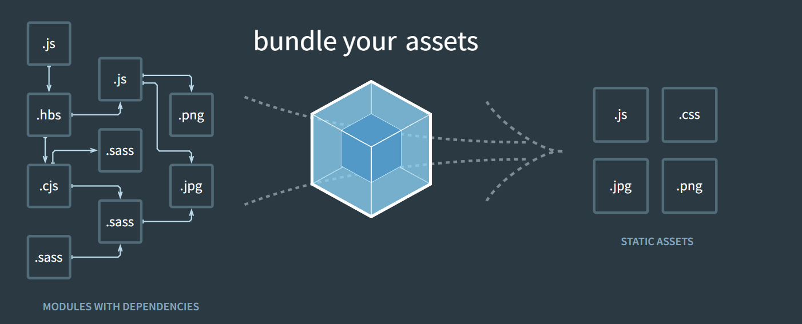

### Webpack的官方文档



> - webpack的官方文档是https://webpack.js.org/
> - webpack的中文官方文档是https://webpack.docschina.org/

> DOCUMENTATION：文档详情，也是我们最关注的

> 点击DOCUMENTATION来到文档页

- API：API，提供相关的接口，可以自定义编译的过程（比如自定义loader和Plugin可以参考该位置的API

- BLOG：博客，等同于上一个tab的BLOG，里面有一些博客文章；

- CONCEPTS：概念，主要是介绍一些webpack的核心概念，比如入口、出口、Loaders、Plugins等等，但是这里并没有一些对它 们解析的详细API；

- CONFIGURATION：配置，webpack详细的配置选项，都可以在这里查询到，更多的时候是作为查询手册；

- GUIDES：指南，更像是webpack提供给我们的教程，我们可以按照这个教程一步步去学习webpack的使用过程；

- LOADERS：loaders，webpack的核心之一，常见的loader都可以在这里查询到用法，比如css-loader、babel-loader、lessloader等等；

- PLUGINS：plugins，webpack的核心之一，常见的plugin都可以在这里查询到用法，比如BannerPlugin、 CleanWebpackPlugin、MiniCssExtractPlugin等等；

- MIGRATE：迁移，可以通过这里的教程将webpack4迁移到webpack5等；

### Webpack 安装

#### 需要安装两个

> 需要 node 环境和 npm 包管理工具

- webpack （核心）
- webpack-cli （管理 webpack 工具）加载 webpack.config.js

#### 它们之间的关系?

- 执行`webpack`命令，会执行node_modules下的.bin目录下的`webpack`； 
- `webpack`在执行时是依赖`webpack-cli`的，如果没有安装就会报错； 
- 而`webpack-cli`中代码执行时，才是真正利用webpack进行编译和打包的过程； 
- 所以在安装webpack时，我们需要同时安装webpack-cli**（第三方的脚手架事实上是没有使用webpack-cli的，而是类似于 自己的vue-service-cli的东西）**

```shell
npm install webpack webpack-cli -g # 全局安装
```

```shell
npm install webpack webpack-cli -D # 局部安装
```

### 传统开发存在的问题

#### 我们的代码存在什么问题呢？某些语法浏览器是不认识的（尤其在低版本浏览器上）

- 1.使用了ES6的语法，比如const、箭头函数等语法；
- 2.使用了ES6中的模块化语法； 
- 3.使用CommonJS的模块化语法； 
- 4.在通过script标签引入时，必须添加上 type="module" 属性；

> 显然，上面存在的问题，让我们在发布静态资源时，是不能直接发布的，因为运行在用户浏览器必然会存在各种各 样的兼容性问题。 

- 我们需要通过某个工具对其进行打包，让其转换成浏览器可以直接识别的语法；

[传统方式code](../code/1_传统方式无法支持模块化和commonJS)

#### 使用webpack打包

[使用webpack默认打包方式code](../code/2_使用webpack打包)

> 会自动到`./src/index.js`进行打包

```shell
-> webpack
asset main.js 353 bytes [emitted] [compared for emit] [minimized] (name: main)
orphan modules 130 bytes [orphan] 1 module
./src/index.js + 1 modules 443 bytes [built] [code generated]
./src/js/format.js 170 bytes [built] [code generated]

WARNING in configuration
The 'mode' option has not been set, webpack will fallback to 'production' for this value.
Set 'mode' option to 'development' or 'production' to enable defaults for each environment.       
You can also set it to 'none' to disable any default behavior. Learn more: https://webpack.js.org/configuration/mode/

webpack 5.64.4 compiled with 1 warning in 402 ms
```

#### 使用项目中的 webpack

[code](../code/3_使用项目中的webpack)

> 使用`npm init`生成 package.json

```
npm install webpack webpack-cli -D # 安装到项目中 node_modules
```

使用项目中的webpack会执行本地的webpack

- `./node_modules/.bin/webpack`

- `npx webpack`
- 在 `package.json` 的脚本里面添加`"build: "webpack"` (常用)

