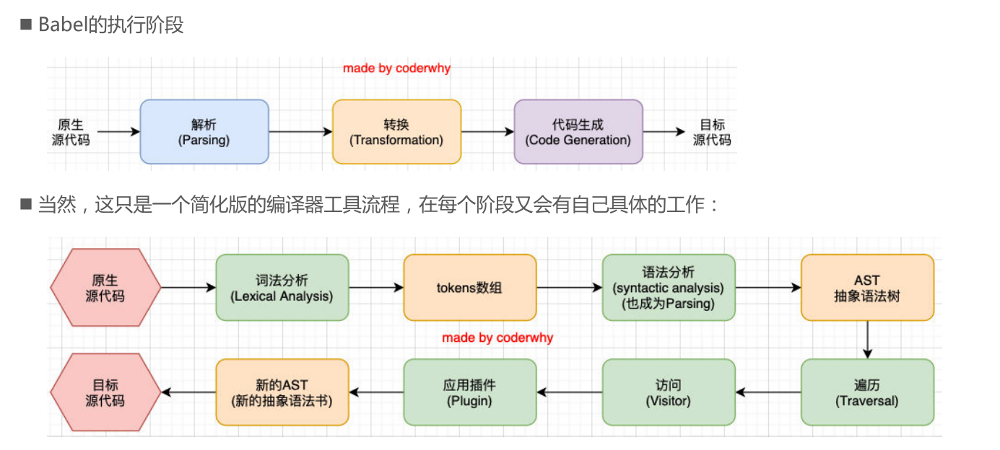

# 06_Webpack的babel

## 为什么需要babel？

- 事实上，在开发中我们很少直接去接触babel，但是babel对于前端开发来说，目前是不可缺少的一部分： 
  - 开发中，我们想要使用ES6+的语法，想要使用TypeScript，开发React项目，它们都是离不开Babel的； 
  - 所以，学习Babel对于我们理解代码从编写到线上的转变过程直观重要； 
  - 了解真相，你才能获得真知的自由！
- 那么，Babel到底是什么呢？ 
  - Babel是一个工具链，主要用于旧浏览器或者缓解中将ECMAScript 2015+代码转换为向后兼容版本的 JavaScript；
  - 包括：**语法转换、源代码转换、Polyfill**实现目标缓解缺少的功能等；

## Babel命令行使用

- babel本身可以作为一个独立的工具（和postcss一样），不和webpack等构建工具配置来单独使用。
- 如果我们希望在命令行尝试使用babel，需要安装如下库： p@babel/core：babel的核心代码，必须安装； p@babel/cli：可以让我们在命令行使用babel；

```shell
npm install @babel/cli @babel/core
```

- 使用babel来处理我们的源代码： 
  - src：是源文件的目录； 
  - --out-dir：指定要输出的文件夹dist；

```shell
npx babel src --out-dir dist
```

> 内容不会改变，需要安装对应的插件

#### 插件转化箭头函数

```shell
npm install @babel/plugin-transform-arrow-functions -D
```

> 命令行使用

```shell
npx babel src --out-dir dist --plugins=@babel/plugin-transform-arrow-functions
```

```js
const message = "Hello World";

const foo = function (info) {
  console.log(info);
};

foo(message);
```

#### 块级作用域转化

```shell
npm install @babel/plugin-transform-block-scoping -D
```

```shell
npx babel src --out-dir dist --plugins=@babel/plugin-transform-arrow-functions,@babel/plugin-transform-block-scoping
```

```js
var message = "Hello World";

var foo = function (info) {
  console.log(info);
};

foo(message);
```

### 使用预设

- 但是如果要转换的内容过多，一个个设置是比较麻烦的，我们可以使用预设（preset）：
  - 后面我们再具体来讲预设代表的含义；

> 一系列插件的组合

- 使用

```shell
npx babel src --out-dir result --presets=@babel/preset-env
```

```js
"use strict"; // 使用严格模式
var message = "Hello World";

var foo = function foo(info) {
  console.log(info);
};

foo(message);
```

## Babel 的底层原理

- babel是如何做到将我们的一段代码（ES6、TypeScript、React）转成另外一段代码（ES5）的呢？
  - 从一种源代码（原生语言）转换成另一种源代码（目标语言），这是什么的工作呢？ 
  - 就是编译器，事实上我们可以将babel看成就是一个编译器。 
  - Babel编译器的作用就是将我们的源代码，转换成浏览器可以直接识别的另外一段源代码；
- Babel也拥有编译器的工作流程：
  - 解析阶段（Parsing） 
  - 转换阶段（Transformation） 
  - 生成阶段（Code Generation）




- https://resources.jointjs.com/demos/javascript-ast
- https://github.com/jamiebuilds/the-super-tiny-compiler

## Babel-loader

- 在实际开发中，我们通常会在构建工具中通过配置babel来对其进行使用的，比如在webpack中。

- 那么我们就需要去安装相关的依赖：

  - 如果之前已经安装了@babel/core，那么这里不需要再次安装；

  ```shel
  npm install babel-loader @babel/core
  ```

  ```js
        {
          test: /\.js$/,
          use: 'babel-loader'
        }
  ```

#### 指定使用那些 babel 插件

```js
{
        test: /\.js$/,
        use: {
          loader: 'babel-loader',
          options: {
            plugins: [
              '@babel/plugin-transform-arrow-functions',
              '@babel/plugin-transform-block-scoping',
            ],
          },
        },
      },
```

## Babel-preset

> 会根据 browserslist 文件，调整预设规则

- 如果我们一个个去安装使用插件，那么需要手动来管理大量的babel插件，我们可以直接给webpack提供一个 preset，webpack会根据我们的预设来加载对应的插件列表，并且将其传递给babel。

- 比如常见的预设有三个： 

  - env 
  - react 
  - TypeScript

- 安装preset-env：

  ```shell
  npm install @babel/preset-env
  ```

```js
{
        test: /\.js$/,
        use: {
          loader: 'babel-loader',
          options: {
            presets: ['@babel/preset-env'],
          },
        },
      },
```

### 设置目标浏览器的 targets

```js
{
        test: /\.js$/,
        use: {
          loader: 'babel-loader',
          options: {
            presets: [['@babel/preset-env', { targets: 'chrome 88' }]],
          },
        },
      },
```

- 那么，如果两个同时配置了，哪一个会生效呢？ 
  - 配置的targets属性会覆盖browserslist； 
  - 但是在开发中，更推荐通过browserslist来配置，因为类似于postcss工具，也会使用browserslist，进行统一浏览器 的适配；
