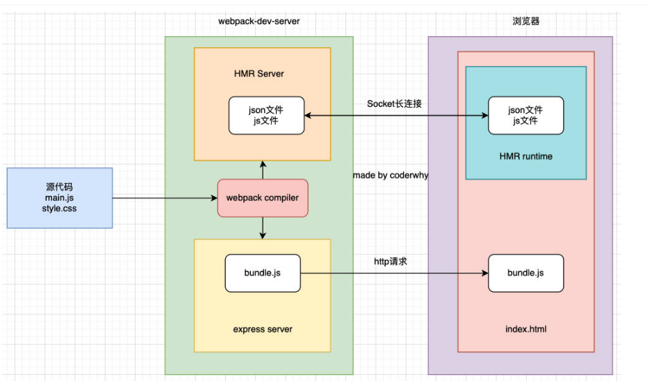

# Webpack的devServer和HMR

## 为什么要搭建本地服务器？

- 目前我们开发的代码，为了运行需要有两个操作： 
  - npm run build，编译相关的代码； 
  - 操作二：通过live server或者直接通过浏览器，打开index.html代码，查看效果；
- 这个过程经常操作会影响我们的开发效率，我们希望可以做到，当文件发生变化时，可以自动的完成编译和展示； 
- 为了完成自动编译，webpack提供了几种可选的方式： 
  - webpack watch mode； 
  - webpack-dev-server； 
  - webpack-dev-middleware

## Webpack watch

- webpack给我们提供了watch模式： 
  - 在该模式下，webpack依赖图中的所有文件，只要有一个发生了更新，那么代码将被重新编译； 
  - 我们不需要手动去运行 `npm run build`指令了；
- 开启`watch`
  - 在`webpack.config.js`中添加`watch: true`
  - 在启动webpack命令中添加`--watch`

## Webpack-dev-server

- 上面的方式可以监听到文件的变化，但是事实上它本身是没有自动刷新浏览器的功能的：
  - 当然，目前我们可以在VSCode中使用live-server来完成这样的功能；
  - 但是，我们希望在不适用live-server的情况下，可以具备live reloading（实时重新加载）的功能；
- 安装 `webapck-dev-server`

```shell
npm install webpack-dev-server -D
```

- 添加一个sctipt脚本

```js
"serve": "webpack serve",
```

> webpack-dev-server 在编译之后不会写入到任何输出文件。而是将 bundle 文件保留在内存中： 
>
> > 事实上webpack-dev-server使用了一个库叫memfs（memory-fs webpack自己写的）

## Webpack-dev-middleware

- 默认情况下，webpack-dev-server已经帮助我们做好了一切： 
  - 比如通过express启动一个服务，比如HMR（热模块替换）； 
  - **如果我们想要有更好的自由度**，可以使用webpack-dev-middleware；
- 什么是webpack-dev-middleware？ 
  - webpack-dev-middleware 是一个封装器(wrapper)，它可以把 webpack 处理过的文件发送到一个 server； 
  - webpack-dev-server 在内部使用了它，然而它也可以作为一个单独的 package 来使用，以便根据需求进行 更多自定义设置；
- 安装 `webpack-dev-middleware`

> 这里使用 express 提供服务

```shell
npm install webpack-dev-middleware express -D
```

- server.js代码

```js
const express = require('express');
const webpack = require('webpack');
const webpackDevMiddleware = require('webpack-dev-middleware');

const app = express();
// 获取配置信息
const config = require('./webpack.config.js');
// webpack 编译器
const compiler =  webpack(config);
// 中间件
const middleware = webpackDevMiddleware(compiler);
// 使用中间件
app.use(middleware);

app.listen(3000, () => {
  console.log("服务已经开启在3000端口...");
})
No newline at end of file

```

> ```shell
> node server.js
> ```
>
> 启动服务

# 认识模块热替换（HMR）

- 什么是HMR呢？ 
  - HMR的全称是Hot Module Replacement，翻译为模块热替换； 
  - 模块热替换是指在应用程序运行过程中，替换、添加、删除模块，而无需重新刷新整个页面；
- HMR通过如下几种方式，来提高开发的速度： 
  - 不重新加载整个页面，这样可以保留某些应用程序的状态不丢失； 
  - 只更新需要变化的内容，节省开发的时间； p修改了css、js源代码，会立即在浏览器更新，相当于直接在浏览器的devtools中直接修改样式；
- 如何使用HMR呢？ 
  - 默认情况下，webpack-dev-server已经支持HMR，我们只需要开启即可； 
  - 在不开启HMR的情况下，当我们修改了源代码之后，整个页面会自动刷新，使用的是live reloading；

## 开启 HMR

> webpack.config.js

```js
  devServer: {
    hot: true,
  },
```

- 但是你会发现，当我们修改了某一个模块的代码时，依然是刷新的整个页面： 
  - 这是因为我们需要去指定哪些模块发生更新时，进行HMR；

> index.js

```js
import './math.js';

 console.log('Hello Webpack!');
 console.log('Hello Webpack middleware!');

 if (module.hot) {
  module.hot.accept('./math.js', () => {
   console.log("math模块发生了更新...")
  })
 }
```

> math 模块发生变化会启动 HMR

## 框架的 HMR

- 有一个问题：在开发其他项目时，我们是否需要经常手动去写入 module.hot.accpet相关的API呢？ 
  - 比如开发Vue、React项目，我们修改了组件，希望进行热更新，这个时候应该如何去操作呢？ 
  - 事实上社区已经针对这些有很成熟的解决方案了： 
  - 比如vue开发中，我们使用vue-loader，此loader支持vue组件的HMR，提供开箱即用的体验； 
  - 比如react开发中，有React Hot Loader，实时调整react组件（目前React官方已经弃用了，改成使用reactrefresh）；
- 接下来我们分别对React、Vue实现一下HMR功能。

## React 的 HMR

> 在之前，React是借助于React Hot Loader来实现的HMR，目前已经改成使用react-refresh来实现了。

- 安装实现HMR相关的依赖：

> webpack 插件和react-refresh

```shell
npm install -D @pmmmwh/react-refresh-webpack-plugin react-refresh
```

- 修改webpack.config.js

```js
const ReactRefreshWebpackPlugin = require('@pmmmwh/react-refresh-webpack-plugin');
// ...
  plugins: [
    new HtmlWebpackPlugin({
      template: './index.html',
    }),
    new ReactRefreshWebpackPlugin(),
  ],
```

- 修改babel.config.js

```js
module.exports = {
  presets: [
    '@babel/preset-env', //
    '@babel/preset-react',
  ],
  plugins: [
    [
      'react-refresh/babel', //
    ],
  ],
};
```

## Vue 的 HMR

- Vue的加载我们需要使用vue-loader，而vue-loader加载的组件默认会帮助我们进行HMR的处理。
- 安装依赖

```shell
npm install vue-loader vue-template-compiler -D
```

- webpack.config.js

```js
const VueLoaderPlugin = require('vue-loader/lib/plugin');
// ...
  plugins: [
 @@ -25,5 +43,6 @@ module.exports = {
      template: './index.html',
    }),
    new ReactRefreshWebpackPlugin(),
    new VueLoaderPlugin(),
  ],
};
```

# HMR 原理

- 那么HMR的原理是什么呢？如何可以做到只更新一个模块中的内容呢？ 

  - webpack-dev-server会创建两个服务：提供静态资源的服务（express）和Socket服务（net.Socket）； 
  - express server负责直接提供静态资源的服务（打包后的资源直接被浏览器请求和解析）；

- HMR Socket Server，是一个socket的长连接： 

  - 长连接有一个最好的好处是建立连接后双方可以通信（服务器可以直接发送文件到客户端）； 
  - 当服务器监听到对应的模块发生变化时，会生成两个文件.json（**manifest文件**）和.js文件（update chunk）； 
  - 通过长连接，可以直接将这两个文件主动发送给客户端（浏览器）； 
  - 浏览器拿到两个新的文件后，通过HMR runtime机制，加载这两个文件，并且针对修改的模块进行更新；

  