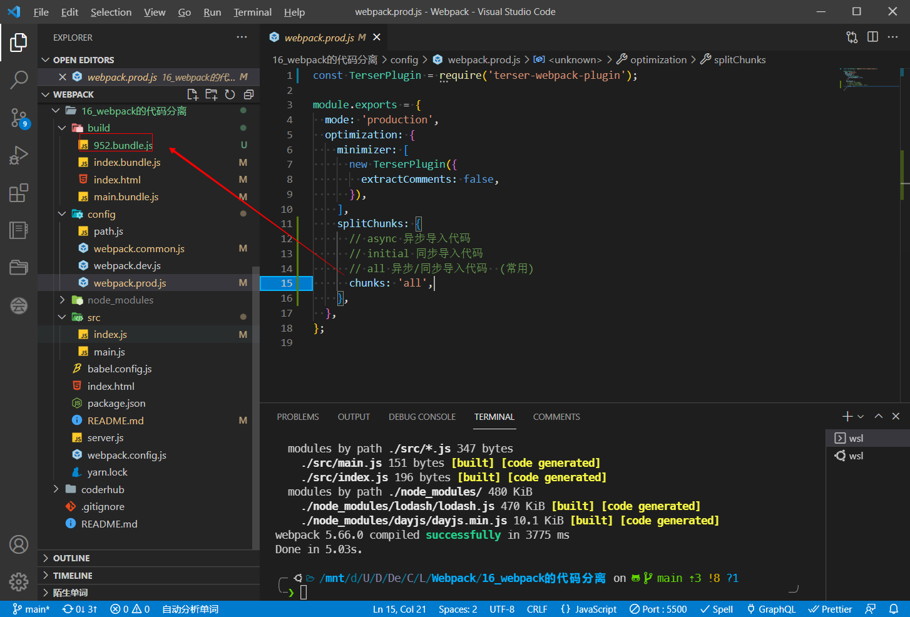

# Webpack的代码分离

## 认识代码分离

- 代码分离（Code Splitting）是webpack一个非常重要的特性： 
  - 它主要的目的是将代码分离到不同的bundle中，之后我们可以按需加载，或者并行加载这些文件； 
  - 比如默认情况下，所有的JavaScript代码（业务代码、第三方依赖、暂时没有用到的模块）在首页全部都加载， 就会影响首页的加载速度；
  - 代码分离可以分出出更小的bundle，以及控制资源加载优先级，提供代码的加载性能；
  
- Webpack中常用的代码分离有三种：
  - 入口起点：使用entry配置手动分离代码；
  
  ```js
    entry: {
      main: './src/main.js',
      index: './src/index.js',
    },
    output: {
      path: resolveApp('./build'),
      filename: '[name].bundle.js',
      clean: true,
    },	
  ```
  
  - 防止重复：使用Entry Dependencies或者SplitChunksPlugin去重和分离代码；
  
    - Entry Dependencies
  
    ```js
      entry: {
        main: { import: './src/main.js', dependOn: 'shared' },
        index: { import: './src/index.js', dependOn: 'shared' },
        // lodash: 'lodash',
        // dayjs: 'dayjs',
        shared: ['lodash', 'dayjs']
      },
    ```
  
    > Tip:  去除注释信息
    >
    > ```js
    > const TerserPlugin = require("terser-webpack-plugin");
    > 
    > module.exports = {
    >   mode: 'production',
    >   optimization: {
    >     minimizer: [
    >       new TerserPlugin({
    >         extractComments: false,
    >       }),
    >     ],
    >   },
    > };
    > ```
  
    - SplitChunksPlugin
  
      - 另外一种分包的模式是splitChunk，它是使用SplitChunksPlugin来实现的： 
        - 因为该插件webpack已经默认安装和集成，所以我们并不需要单独安装和直接使用该插件； 
        - 只需要提供SplitChunksPlugin相关的配置信息即可；
      - Webpack提供了SplitChunksPlugin默认的配置，我们也可以手动来修改它的配置： 
        - 比如默认配置中，chunks仅仅针对于异步（async）请求，我们可以设置为initial或者all；
  
      ```js
      const TerserPlugin = require('terser-webpack-plugin');
      
      module.exports = {
        mode: 'production',
        optimization: {
          minimizer: [
            new TerserPlugin({
              extractComments: false,
            }),
          ],
          splitChunks: {
            // async 异步导入代码
            // initial 同步导入代码
            // all 异步/同步导入代码  (常用)
            chunks: 'all',
          },
        },
      };
      ```
  
      > 952.bundle.js 为打包的代码
  
      
